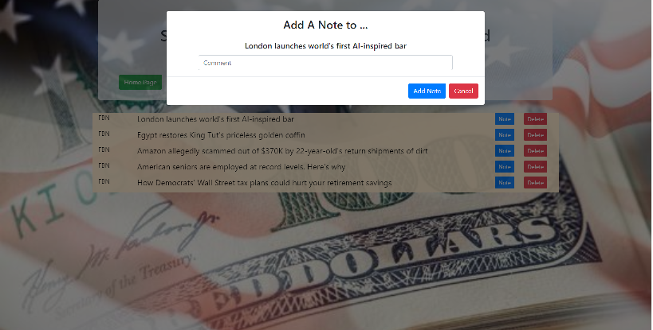

# Extra-Extra-Scrape-It
Scrape financial news from Fox Business or CNBC, save articles of interest to read later and make comments
 

## Here's how the app works

    * The initial page brings you to the page shown below. It may be blank depending how the previous user left it.
    
    * If there are not articles, or to get new articles, click on one of the _Scrape_ buttons to get headlines from CNBC or Fox Business Network.
    * At any time, on either page, you can click on the _Article_ and new tab will be opened with the appropriate article fro that site.
    * You can 'save' an article by click on _save_, which can be viewed in the next page.
    * You can clear all the unsaved articles by clicking on _Clear Unsaved_
    * Clicking on _Saved Articles_ will take you to the next page.
    
    * You can delete a saved _Article_ by clicking on _Delete_ next to the _Article_
    * When you click on _Note_, the modal shown in the screenshot will open. Can add a comment to the _Article_
    * If you click on an _Article_ with existing _Note(s)_ those will be displayed and you can delete them or add a new comment. 

### Design Notes

* Using mongoose schema to make each Article unique. Have to use _link_ rather than _headline_ since the two agencies may have the same headline, in fact, they did during my testing
* Can only add note to a previously saved _Article_
* Can add have multiple _Notes_ to same _Article_

### My Personalizations 

* Using two sources, [cnbc.com](cnbc.com) and [foxbusiness.com](foxbusiness.com)
* Clear all unsaved _Articles_
* Imported a font, the scoreboard font

### Issues

[See the current open issues](https://github.com/janjakubowski/Extra-Extra-Scrape-It/issues)

### Objectives

Must use technologies:

    1. express

    2. express-handlebars - I used jQuery for modal used to add a _Note_

    3. mongoose / mongoDB

    4. cheerio

    5. axios

Leverage knowledge of HTML, CSS, and JavaScript

## My Portfolio 

* [See how it works for yourself, deployed on heroku](https://nameless-reaches-83600.herokuapp.com/)
* [THE CODE: see how the magic happens]
(https://janjakubowski.github.io/Extra-Extra-Scrape-It/)